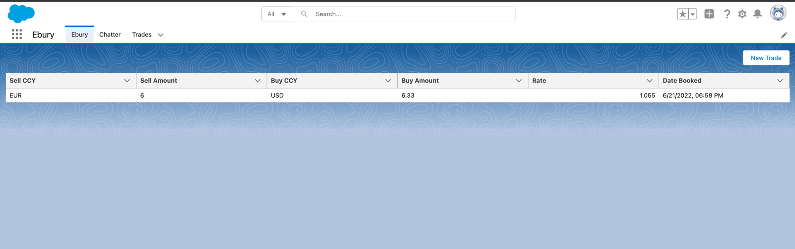
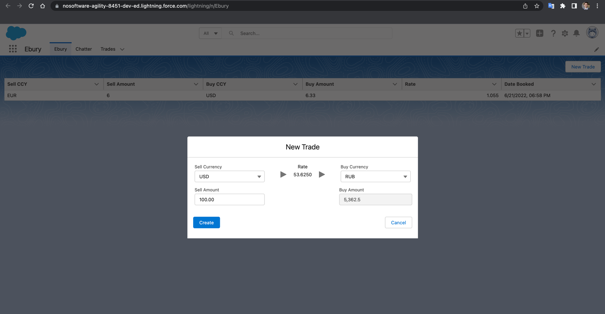
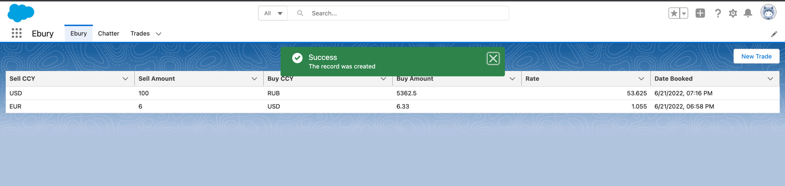
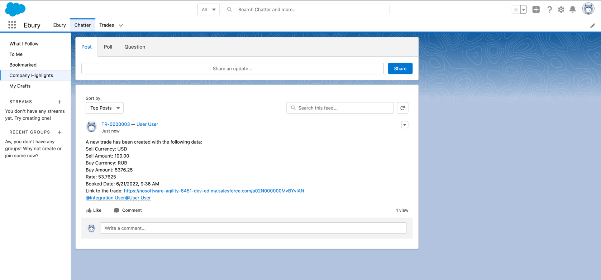

# Ebury technical test
SFDX deployment guide

Prerequisites:

<li>Access to Salesforce DevHub org.</li>
<li>Access to Fixer.io account which provide token.</li> 
Steps: 
1. Run openTest.sh 
1.1 Authorization on DevHub 
1.2 Write scratch org name 
1.3 After executing the script will open your scratch org 
2. Assign appropriate Users to "Trade reviewers" queue. 
3. Create Default Organization Level Value in "Chatter Setting" custom setting with the "Queue Name" field filled in with the value "Trade reviewers"
 
4. Create Default Organization Level Value in "Fixer IO" custom setting with the "Endpoint" field filled in with the value "https://api.apilayer.com" and "Token" field filled in with the value security token whith provide Fixer IO.
  

<strong>Overview</strong>
 

<strong>REQ1</strong> 
<li>Sell Currency and Buy Currency are both picklist fields which reference Global Value Set "Currency"</li> 
 
<li>Where ID is Auto Number with format "TR" + 7 numbers.</li> 

<strong>REQ2</strong> 
<li>We have Trade list view which show us all Trades and sorted by booking date</li> 
 
<li>We have New Trade button which open modal window. When we choose Sell Currency and Buy Currency we got latest rate. </li> 
 
<li>When we fill Sell Amount, Buy Amount show us result</li> 
 
<li>When we click on create. The Trade record will created and our list view updated</li> 
 

<strong>REQ3</strong> 
<li>After creating Trade record we send information in chatter for queue named "Trade reviewers"</li> 
 

<strong>REQ4</strong> 
<li>Fixer IO bring us the latest currency rates</li> 
<li>The Endpoint and Token we store in protected custom settings</li> 

<strong>REQ5</strong> 
<li>We have script "openTest.sh" for deployment automation</li> 

<strong>Code Coverage</strong> 
 